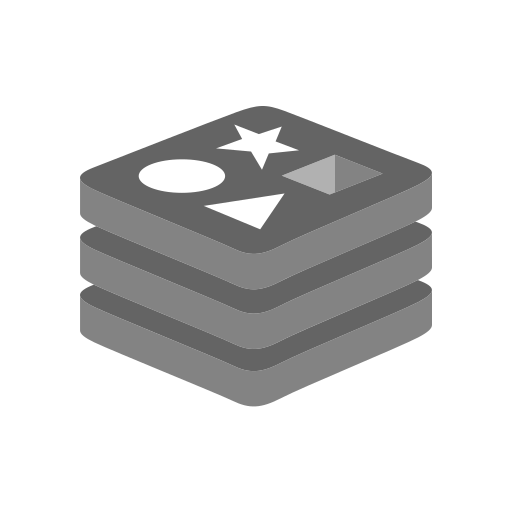

<div align="center">
  <p></p>
  <h1><code>BOOKYARD</code></h1>
</div>

<table>
  <tbody><tr><td align="center" width="99999"><div>
    <a href="https://olankens.com">WEBSITE</a> ·
    <a href="https://ko-fi.com/olankens">FUNDING</a>
  </div></td></tr></tbody>
  <tbody><tr><td align="center" width="99999">&nbsp;<div>
    Use Spring Boot project with robust REST endpoints for comprehensive book catalog records, modern Postgres persistence, layered services, clean OpenAPI documents, and full validation with error handling.
  </div>&nbsp;</td></tr></tbody>
  <tbody><tr><td align="center" width="99999">
    <a href="https://spring.io"></a>
    <picture></picture>
    <a href="https://postgresql.org"></a>
    <picture></picture>
    <a href="https://redis.io"></a>
    <picture></picture>
    <a href="https://kafka.apache.org"></a>
    <picture></picture>
    <a href="https://docker.com"></a>
  </td></tr></tbody>
</table>

## PREVIEWS

<table><tbody><tr><td width="99999">
  <picture></picture>
</td></tr></tbody></table>

## FEATURES

<table>
  <tbody><tr><td width="99999">Spring Boot 4 REST API foundation</td><td>✅</td></tr></tbody>
  <tbody><tr><td>PostgreSQL Hibernate persistence</td><td>✅</td></tr></tbody>
  <tbody><tr><td>OpenAPI docs with Swagger UI</td><td>✅</td></tr></tbody>
  <tbody><tr><td>Docker Compose with health</td><td>✅</td></tr></tbody>
  <tbody><tr><td>Boilerplate reduction with Lombok</td><td>✅</td></tr></tbody>
</table>

## LEARNING

### LAUNCH THE CONTAINERS

```sh
docker compose down
docker compose up --build
```

### UPDATE MAVEN WRAPPER

```sh
address="https://maven.apache.org/download.cgi"
pattern="Apache Maven [0-9]+\.[0-9]+\.[0-9]+"
version="$(curl -s "$address" | grep -A2 'id="CurrentMaven"' | grep -oE "$pattern" | head -1 | awk '{print $3}')"
./mvnw -N wrapper:wrapper -Dmaven="$version"
```